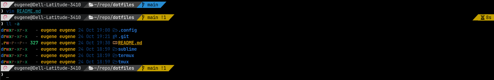
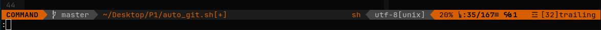

## Shell setup (Linux)

- [Fish shell](https://fishshell.com/)
- [Fisher](https://github.com/jorgebucaran/fisher) - Plugin manager
- [Tide](https://github.com/IlanCosman/tide) - Shell theme.
- [Nerd fonts](https://github.com/ryanoasis/nerd-fonts) - Powerline-patched fonts.
- [Exa](https://the.exa.website/) - `ls` replacement

## Sublime

- [A File Icon](https://github.com/SublimeText/AFileIcon)

## VIM

- [vim-plug](https://github.com/junegunn/vim-plug) - Minimalist Vim Plugin Manager

*Plugins:*
- [vim-fugitive](https://github.com/tpope/vim-fugitive) - A Git wrapper so awesome, it should be illegal
- [vim-colorschemes](https://github.com/flazz/vim-colorschemes)
- [vim-colorscheme-switcher](https://github.com/xolox/vim-colorscheme-switcher) - Makes it easy to quickly switch between color schemes in Vim
- [vim-misc](https://github.com/xolox/vim-misc)
- [nerdtree](https://github.com/preservim/nerdtree) - A tree explorer plugin for vim
- [vim-airline](https://github.com/vim-airline/vim-airline) - lean & mean status/tabline for vim that's light as air
- [vim-airline-themes](https://github.com/vim-airline/vim-airline-themes) - A collection of themes for vim-airline
